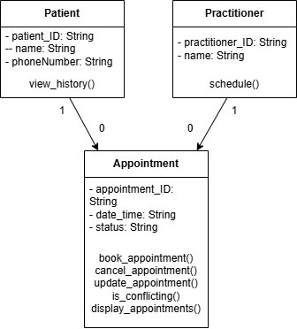

# Requirements Review (Part A)
List nouns, verbs and business rules from SmartCare v0.2:

## Nouns
- Patient
- Practitioner
- Appointment
- Name
- Phone Number
- Time
- Status
- Appointment History

## Verbs
- Record
- Search
- Book
- View
- Update

## Business Rules
- An appointment cannot be booked if an existing (non-cancelled) appointment is already booked for that time.
- Patient name, practitioner name, and appointment time cannot be empty
- Search patient by exact name

# Candidate Classes (Part B)
| Class | Supporting Requirements | State | Behaviour |
| ----- | ----- | ----- | ----- |
| Patient | FR-01, FR-02, FR-06 | patient_ID, name, phone_number | view_history() |
| Practitioner | FR-03, FR-04 | practitioner_ID, name | schedule() |
| Appointment | FR-03, FR-04, FR-05, FR-06, FR-07, FR-08 | appointment_ID, patient, practitioner, date_time, status | book_appointment(), cancel_appointment(), update_appointment(), is_conflicting(), display_bookings() |

# CRC Cards (Part C)
## Patient
| Responsibilities | Collaborators |
| ----- | ----- |
| Holds patient name and phone number | Appointment |
| Can have appointment history searched from name | Appointment |

## Practitioner
| Responsibilities | Collaborators |
| ----- | ----- |
| Holds practitioner name | Appointment |
| Has a list of scheduled appointments  | Appointment |

## Appointment
| Responsibilities | Collaborators |
| ----- | ----- |
| Holds patient, practitioner, time, and status | Patient & Practitioner |
| Status can be updated | N/A |
| Checks for conflicting appointments | Appointment |

# UML Model (Part D)
*Used Draw.io Integration to create a UML model (class, state/attributes, behaviour/operations)*

# Consistency Check (Part H)
| UML Class | UML Attributes | Python Skeleton Attributes | Consistent? |
| ----- | ----- | ----- | ----- |
| Patient | patient_ID, name, phone_number | patient_ID, name, phone_number | Yes |
| Practitioner | practitioner_ID, name | practitioner_ID, name | Yes |
| Appointment | appointment_ID, patient, practitioner, date_time, status | appointment_ID, patient, practitioner, date_time, status | Yes |

Therefore, the Python Skeleton is consistent with the UML Model.
