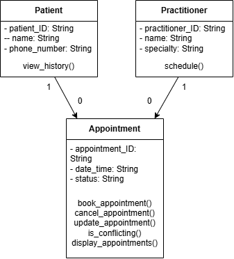

# Revisit Approved UML (Part A)

Potential Discrepencies:
- **Specialty:** Part C of this task specifically refers to the attribute 'specialty', which I did not previously include. To avoid any conflicts, this had been added to the UML Diagram
- **Inconsistent Naming:** phoneNumber doesn't match the formatting of every other attribute, therefore I've taken this opportunity to change that to phone_number

# Implementing Patient and Practitioner (Part B & C)
See classes.py

# Review Generated Code (Part E)
| Review Area | Findings |
| ----- | ----- |
| Model Consistency | Stores patient and practitioner name as plain text rather than assigning to an actual patient/practitioner object. This breaks the UML Diagram I created, where I used ID instead as it's a unique identifier |
| Unsupported Features | Added an additional search_patient() function not listed in the UML |
| Public State Mutation | Every new appointment is added to a shared list in the background with no way to reset it |
| Unnecessary Inheritance | *Not used* |
| Invented Dependencies | Made is_conflicting() a private operation when the UML describes it as public |
| Error Handling | Every error uses ValueError, so different errors (such as empty values and conflicting appointments) can't be told apart |

# Manual Behaviour Checks (Part F)
Using manual_test.py:

| Test | Expected Result | Outcome |
| ----- | ----- | ----- |
| Create valid Patient, Practitioner, Appointment | Objects created successfully | Pass |
| Empty patient_id | ValueError raised | Pass |
| Empty practitioner name | ValueError raised | Pass |
| Empty date_time | ValueError raised | Pass |
| Conflicting booking (same practitioner, same time) | ValueError raised, not added to history | Pass |
| Cancel a scheduled appointment | Status changes to CANCELLED, object still exists | Pass |
| Cancel an already-cancelled appointment | InvalidTransitionError raised | Pass |
| Re-book at the same slot after cancellation | Succeeds | Pass |

# Refactor (Part G)
- Changed patient_name/practitioner_name to actual Patient/Practitioner objects.
- Removed search_patient() since it's not in the UML.
- Made is_conflicting() public again.
- Fixed appointment_time to date_time to match the UML.
- Removed the shared appointments list that every appointment was silently added to. Appointments only get added to patient/practitioner once book_appointment() checks there's no conflict.
- Also noticed view_history() and schedule() were only printing a message instead of actually returning anything, so fixed those to return the real appointment list.